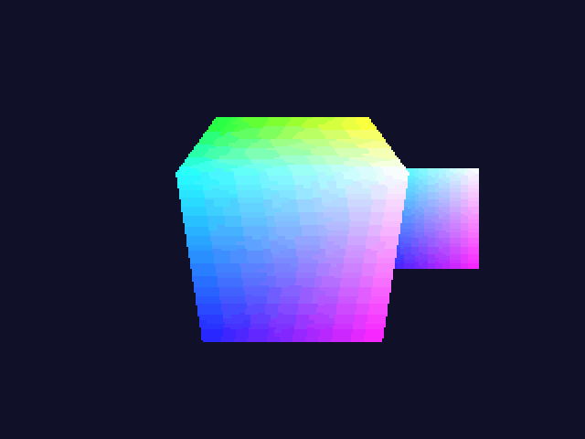
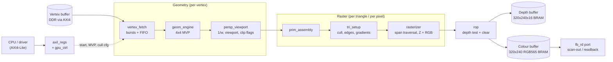

# GPU pipeline: a fixed-function 3D rasterizer in SystemVerilog

[](https://github.com/AdiM358/gpu-pipeline/actions/workflows/regression.yml)

A complete fixed-function graphics pipeline, from triangles in memory to a
depth-tested, Gouraud-shaded image in on-chip block RAM. It targets a Zynq-7020
(`xc7z020clg400-1`) and closes timing at **100 MHz** post-route in Vivado.
It is verified pixel for pixel against a bit-accurate C++ reference model,
and its depth-test unit has a UVM environment built from a written
verification plan.



*Every frame above was produced by the RTL in simulation, read back through
the hardware framebuffer port, and checked against the golden model.*

> **Status:** this design has been simulated (Verilator, and Vivado xsim for
> the UVM environment) and synthesised and
> implemented (Vivado, Yosys). It has **not** been run on an FPGA board.

---

## Highlights

| | |
|---|---|
| **Pipeline** | AXI4 vertex fetch → 4x4 transform → perspective divide and viewport → triangle setup with culling → span rasterizer with Z and colour interpolation → depth-test ROP → colour and depth buffers |
| **FPGA** | Fmax 100 MHz post-route; 9,590 LUTs (18%), 98 BRAM tiles (70%), 36 DSPs (16%) on the XC7Z020 |
| **Performance** | ~993 frames/s projected for the demo scene (100,665 simulated cycles per frame at 100 MHz); depth test at 1 fragment per cycle |
| **Verification** | bit-accurate C++ golden model; 12 self-checking tests with constrained-random AXI timing; 98.9% line coverage; CI. UVM environment for the ROP with 100% functional coverage and a bug-injection check |
| **Software** | AXI4-Lite register interface, C header, and a C++ driver that the testbench itself uses |

Measured improvements over the original version of this design (simulation):

| Change | Before | After |
|---|---:|---:|
| Vertex fetch (credit-based burst prefetch) | 11.00 cycles/vertex (42.00 with 32-cycle memory latency) | 4.02 (4.14) |
| Depth test (pipelined, with read-after-write forwarding) | 3.00 cycles/fragment | 1.00 |
| Rasterizer (4-pixel span traversal vs 1) | 0.259 fragments/cycle | 0.652 |
| Timing at 100 MHz (splitting the viewport stage) | WNS −2.291 ns | +0.253 ns |

All numbers, with the command that produced each one, are in
[METRICS.md](METRICS.md).

---

## Architecture



Every stage-to-stage link is a valid/ready handshake, so back-pressure
propagates from the ROP all the way to the AXI bus. Key design choices:

- **Rate matching.** The 32-bit bus delivers one vertex every 4 cycles, so
  the transform uses 4 multipliers over 4 cycles rather than 16 in one. The
  perspective divider is pipelined (1 per cycle) while the per-triangle setup
  divider is iterative, because setup hides behind rasterization.
- **Correct rasterization.** Incremental edge functions with a top-left fill
  rule, so shared edges are drawn exactly once. Z and colour are stepped with
  additions only.
- **A 1-fragment-per-cycle depth test.** The read-modify-write hazard is
  resolved by forwarding the last three writes instead of stalling.
- **On-chip buffers sized to fit.** 320x240 RGB565 plus 16-bit depth, with a
  hardware clear and an external read port.

More detail:

- [docs/ARCHITECTURE.md](docs/ARCHITECTURE.md): layout, stages, number formats.
- [docs/ASM.md](docs/ASM.md): cycle-level state machine charts for every
  controller.
- [docs/DESIGN_NOTES.md](docs/DESIGN_NOTES.md): every decision and trade-off,
  with measurements.
- [docs/REGMAP.md](docs/REGMAP.md): the register map.

---

## Verification

Two layers, each with its own reference model:

- **Whole pipeline (Verilator + C++).** Every stage and the full system are
  compared bit-exactly with the C++ golden model under constrained-random
  stimulus and bus timing. Every pixel, depth value and counter matches on
  17 system-test frames and 48 demo frames. This runs in CI.
- **ROP block level (SystemVerilog UVM 1.2).** [`tb/uvm/`](tb/uvm/README.md)
  implements [`docs/VERIFICATION_PLAN.md`](docs/VERIFICATION_PLAN.md): seven
  features (depth test, read-after-write forwarding, bubbles, handshake,
  clear, screen edges, read port) and three preconditions, each with its
  stimulus, checker and coverage. It has a constrained-random and directed
  agent, a scoreboard with an in-order reference model that checks each
  `frag_pass` at its exact cycle and reads back the whole framebuffer, and
  five covergroups mapped to the plan.

`tb/uvm/run_xsim.sh rop_full_test <seed>` on Vivado xsim 2026.1:

| Seed | Fragments | `frag_pass` matched | Readback mismatches | Errors | Functional coverage |
|---|---:|---:|---:|---:|---|
| 1 | 12,890 | 3,433 / 3,433 | 0 of 153,600 | 0 | 100% (5 of 5 covergroups) |
| 2 | 12,890 | 3,404 / 3,404 | 0 of 153,600 | 0 | 100% (5 of 5 covergroups) |

To check that the scoreboard actually catches bugs, a copy of `rop.sv` with
the distance-2 forwarding path removed fails the directed forwarding test
with 10 errors and the full test with 13, and every `frag_pass` error names
the cause ("distance to last write 2"). Known coverage gaps are listed in the
plan. The UVM environment needs xsim, so it is not part of CI.

---

## Build, test and synthesise

The toolchain is Verilator 5.020, g++ and make. The same versions run in
Docker and in CI.

```sh
# Linux / macOS / WSL with Verilator installed:
make all              # 12 self-checking tests; non-zero exit on any failure
make coverage         # same, with merged line coverage + per-module report
make demo             # render 48 frames -> out/demo/*.ppm and docs/img/demo.gif
make perf             # draw-cycle benchmark at RAST_SPAN 1/2/4/8
make baseline-bench   # original units from the `baseline` tag, same workloads
make seeds            # rerun the regression with more random seeds

# Windows (Docker Desktop): any target through the container
scripts/docker-make.sh all
```

FPGA (Vivado ML Standard, free, with a no-charge license):

```sh
fpga/sweep.sh period 10 9.5 9 8   # clock sweep -> fpga/reports/summary.md
fpga\sweep.ps1 period 10 9 8      # same, from PowerShell
```

UVM environment for the ROP (Vivado xsim, from Git Bash):

```sh
tb/uvm/run_xsim.sh rop_full_test 1   # any test, any seed; see tb/uvm/README.md
```

An open-source synthesis cross-check (Yosys via Docker) is described in
[fpga/README.md](fpga/README.md).

---

## Repository layout

```
rtl/        synthesizable SystemVerilog (12 modules)
model/      bit-accurate C++ golden model
sw/         C register header + C++ driver
tb/         Verilator testbenches + shared harness, BFMs, scenes
tb/uvm/     UVM 1.2 environment for the ROP (xsim)
bench/      the original units, for before/after measurements
fpga/       Vivado and Yosys flows, reports
docs/       architecture, ASM charts, design notes, register map, verification plan
```

---

## Limitations

- **Not run on hardware.** No board was available. The top level is written
  for a Zynq PS connection (AXI-Lite control, AXI4 reads from DDR), but that
  integration has not been built.
- **No clipping.** Triangles crossing the near plane, or extending beyond the
  ±1024-pixel guard band, are dropped and counted rather than clipped.
- **Colour is not perspective-correct.** It is interpolated linearly in screen
  space (Gouraud). Depth is correct.
- **The clear dominates simple frames.** It takes 76,801 of about 100,665
  cycles in the demo. A fast clear is the most valuable next optimisation.
- **Block RAM mapping is inefficient.** Vivado uses 98 tiles where 76 would
  suffice, because the buffers are not power-of-two deep.
- **The timing margin is small.** +0.253 ns at 100 MHz. The limiting paths above
  100 MHz are identified in DESIGN_NOTES (phase 9b).
- **Fixed format.** 320x240, RGB565 colour, 16-bit depth, triangle lists
  only, no textures.
