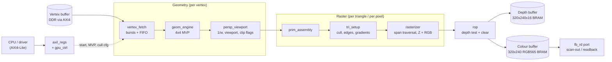
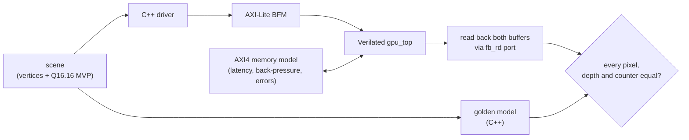

# Architecture and project structure

A fixed-function 3D graphics pipeline in SystemVerilog: triangles in memory
go in, and a depth-tested, Gouraud-shaded 320x240 image in on-chip block RAM
comes out. The target device is a Zynq-7020 (`xc7z020clg400-1`). Every result
comes from Verilator simulation or synthesis tools; nothing has run on a
board.

This document explains what each piece does and why it has the shape it has.
The decision-by-decision reasoning, with measurements, is in
[DESIGN_NOTES.md](DESIGN_NOTES.md), the register interface is in
[REGMAP.md](REGMAP.md), and the original audit is in [PLAN.md](PLAN.md).

---

## 1. Repository layout

```
rtl/                     synthesizable SystemVerilog (one module per file)
  gpu_top.sv             top level: wires every stage together, perf counters
  axil_regs.sv           AXI4-Lite slave + register file
  gpu_ctrl.sv            command sequencer: CLEAR -> DRAW -> drain -> DONE
  vertex_fetch.sv        AXI4 burst reader, prefetch FIFO
  geom_engine.sv         4x4 matrix transform (model -> clip space)
  recip_pipe.sv          32-stage pipelined divider, floor(2^44 / w)
  persp_viewport.sv      perspective divide, viewport, clip flags
  prim_assembly.sv       groups 3 vertices into a triangle
  tri_setup.sv           cull/reject, edge equations, attribute gradients
  rasterizer.sv          span rasterizer, incremental Z + colour
  rop.sv                 depth test, framebuffer writes, clear engine
  sdp_ram.sv             block-RAM template used for both buffers

model/gpu_model.{h,cpp}  bit-accurate C++ golden model (the numeric spec)
sw/gpu_regs.h            C register map (offsets, bits, vertex struct)
sw/gpu_driver.hpp        C++ driver over an abstract register bus

tb/                      Verilator testbenches (one per module + system)
  common/sim.h           harness: CHECK macros, seeds, tracing, coverage
  common/axil_master.h   AXI-Lite master BFM (implements the driver's bus)
  common/axi_mem.h       AXI4 memory model: latency, back-pressure, errors
  common/scenes.h        test/demo scenes and matrix helpers
  common/gpu_system.h    full-system harness shared by the system tests
  gpu_top_tb.cpp         system regression (pixel-exact vs the model)
  demo_tb.cpp            renders the animated demo
  perf_tb.cpp            RAST_SPAN benchmark
bench/                   the ORIGINAL fetch / pixel units, measured for before/after

fpga/build.tcl           Vivado out-of-context synth + place + route, one config
fpga/sweep.sh            clock-period / RAST_SPAN / baseline-module sweeps
fpga/summarize.py        Vivado reports -> Markdown table
fpga/yosys_report.py     open-source synthesis cross-check (no timing)

scripts/                 docker-make.sh, coverage_report.py, make_gif.py
docker/                  Verilator image (same packages as CI), Yosys image
.github/workflows/       CI: lint, coverage regression, fresh-seed rerun
docs/                    this file, PLAN, DESIGN_NOTES, REGMAP, img/demo.gif
```

Main commands (on Windows run them through `scripts/docker-make.sh <target>`):

| Command | What it does |
|---|---|
| `make all` | builds and runs all 12 tests; non-zero exit if any check fails |
| `make coverage` | the same, with line coverage, plus a per-module report |
| `make seeds SEEDS="2 3 4"` | reruns the regression with other stimulus seeds |
| `make demo` | renders 48 frames, checks each against the model, writes the GIF |
| `make perf` | draw-cycle benchmark at RAST_SPAN 1, 2, 4, 8 |
| `make baseline-bench` | measures the original fetch and pixel units from the `baseline` tag |

---

## 2. The pipeline



Every stage-to-stage link is a **valid/ready handshake**. A transfer happens
when both are high, and a stage holds its output until the next stage takes
it. Back-pressure therefore propagates automatically, from a stalled ROP all
the way back to the AXI bus.

### Stage by stage

| Stage | Input | Output | Rate | Key idea |
|---|---|---|---|---|
| **vertex_fetch** | base address, count | vertex (x,y,z Q16.16, RGB888) | 1 vertex / 4 cycles (bus limit) | 16-byte vertices, 4-vertex bursts, up to 4 bursts in flight, FIFO space reserved before requesting, bursts split at 4 KB, bus errors abandon the draw cleanly |
| **geom_engine** | vertex, MVP matrix | clip-space x,y,z,w | 1 vertex / 4 cycles | rate-matched: 4 multipliers compute one output row per cycle instead of 16 in parallel |
| **persp_viewport** | clip x,y,z,w | screen x,y (Q11.4), depth (16-bit), 8 flag bits | 1 vertex / cycle | one pipelined reciprocal of w plus 3 multiplies replaces 3 dividers; outcodes, near-plane and guard-band flags computed here |
| **prim_assembly** | vertices | triangle (3 vertices) | no bubbles | flushed at each draw so a short draw can't misalign the next |
| **tri_setup** | triangle | bounding box, 3 edge equations, 4 attribute planes | 57-cycle latency, overlapped with raster | reject/cull decisions, winding normalised, top-left fill rule, gradients from one normalised reciprocal and one shared multiplier |
| **rasterizer** | setup data | fragments (x, y, z, r, g, b) | ≤ 1 fragment/cycle | tests RAST_SPAN pixels per cycle and skips empty spans; attributes stepped with adds only (38-bit modular accumulators) |
| **rop** | fragments | framebuffer writes | 1 fragment / cycle | pipelined read-compare-write with 3-entry forwarding for read-after-write hazards; hardware clear |

### Number formats

| Quantity | Format |
|---|---|
| model / clip coordinates, MVP matrix | Q16.16, 32-bit signed |
| 1/w | floor(2^44 / w), 32-bit unsigned (requires w > 1/16) |
| screen x, y | Q11.4, 16-bit signed (1/16-pixel precision, guard band ±1024 px) |
| edge functions | 34-bit signed |
| attribute accumulators | 38-bit, 20 fraction bits, wrap modulo 2^38 |
| depth | 16-bit unsigned, 0 = near, 0xFFFF = far (cleared value) |
| colour | RGB888 per vertex, stored as RGB565 |

### How a triangle is decided

1. **Clipped** (counted in `PERF_TRI_CLIPPED`) if any of these holds:
   - all three vertices are outside the same frustum plane (trivial reject);
   - any vertex is at or behind the near plane (w ≤ 1/16);
   - any vertex is outside the guard band;
   - its bounding box contains no pixel centre.
2. **Culled** (`PERF_TRI_CULLED`) if it has zero area, or it is back-facing
   and culling is enabled.
3. Otherwise it is **rasterized**. Its winding is made positive, so "inside"
   means all three edge functions are ≥ 0, with a -1 bias on edges that are
   neither top nor left. Each pixel on a shared edge is drawn exactly once.

### Control, status and memory

- **gpu_ctrl** runs a command: optional CLEAR (76,800 cycles, one pixel per
  cycle), then optional DRAW, then waits until fetch has finished *and* every
  stage reports idle. Only then does it set DONE, so DONE means every pixel is
  written.
- **axil_regs** exposes CTRL, STATUS (sticky DONE/FETCH_ERR, write-1-to-clear),
  configuration, the MVP matrix, and 8 performance counters: cycles,
  vertices, triangles in/culled/clipped, fragments generated/passed, and
  rasterizer-busy cycles.
- **Buffers:** two 76,800 x 16-bit block RAMs. Yosys maps them to 76 RAMB36E1
  of the device's 140. The colour buffer's second port is the external read
  port. Depth reads share the depth test's port, so they're valid only while
  the GPU is idle.

---

## 3. How it is verified



- **Golden model** (`model/`): a C++ description of the exact integer
  arithmetic. It evaluates each pixel directly from plane equations, while
  the RTL steps incrementally with spans and pipelining. Because the two
  formulations differ, agreement checks the RTL's traversal logic rather
  than a transcription of the model.
- **Unit tests** compare each module bit-for-bit with the matching model
  stage, under random stimulus and random back-pressure: thousands of
  vertices and triangles per test, and the rasterizer at span widths 1, 4
  and 8.
- **Directed tests** cover the corners: AXI ordering and strobes, W1C races,
  4 KB burst splits, bus errors, near/guard-band boundaries, degenerate and
  sliver triangles, the fill-rule mesh, and depth hazards at every
  forwarding distance.
- **System test:** 16 renders compared pixel-for-pixel and counter-for-counter
  with the model, including random memory latency, a command written while
  busy, the IRQ pin, bus-error recovery, and a partial triangle.
- **Coverage:** 98.9% line coverage (349/353 points). The 4 misses are two
  unreachable FSM defaults and an attribute clamp that a 97.8-million-fragment
  search showed is never triggered.
- **CI:** the same Verilator version as local runs; lint, coverage regression,
  and a fresh-seed rerun on every push.

---

## 4. Where numbers come from

| Kind | Source |
|---|---|
| cycle counts, throughput, fragments | Verilator simulation, read from the hardware performance counters or counted by the testbench |
| before/after for fetch and pixel units | the original RTL rebuilt from the `baseline` git tag, same workloads |
| cell counts (LUT, FF, DSP, BRAM) | Yosys `synth_xilinx` (a cross-check, not Vivado) |
| Fmax, timing, Vivado utilization, power | `fpga/sweep.sh`, **not yet run**: Vivado was not available |
| frames per second | only as simulated cycles/frame ÷ post-route Fmax, so blank until Vivado is run |
