# RTL ASM charts

Algorithmic State Machine (ASM) charts for every controller in the pipeline,
drawn from the RTL in `rtl/`. They complement
[ARCHITECTURE.md](ARCHITECTURE.md), which shows *what* each stage does. These
charts show *how*: which registers change, on which condition, in which cycle.

## Notation

| Symbol | Meaning |
|---|---|
| **Rectangle** (state box) | A state. The first line is the state name; the rest are Moore outputs (true for the whole state) and unconditional register transfers `r ← expr`. |
| **Diamond** (decision box) | A condition evaluated in the same clock cycle. |
| **Rounded box** (conditional output) | A Mealy output or register transfer that happens only on that path, in the same clock cycle. |
| Arrow into a state box | The next state, taken at the next rising clock edge. |

A state box plus all the decisions and conditional boxes below it, up to the
next state box, is one **ASM block**: everything in it happens in one clock
cycle. Transfers use non-blocking semantics, so every `←` in a block reads
the values from *before* the edge. Single-cycle pulses (`start_draw`,
`culled`, `error_set`, ...) default to 0 in every state unless a box sets
them. `en` in a pipelined stage means "the downstream register is free":
`en = not out_valid or out_ready`.

---

## 0. Controller / datapath overview (ASMD)

The whole GPU is one control unit, `gpu_ctrl` (sequenced by software through
`axil_regs`), driving a chain of datapath stages. The stages hand data to each
other with valid/ready handshakes and report status back.

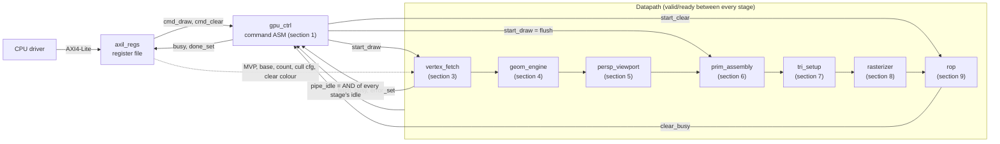

---

## 1. `gpu_ctrl`: command sequencer

One command is CLEAR, DRAW, or both (clear first). DONE is signalled only when
the vertex fetch has finished **and** every stage has been idle for
`DRAIN_CYCLES + 1` consecutive cycles (`gpu_top` uses `DRAIN_CYCLES = 1`), so
DONE means every pixel is in memory.

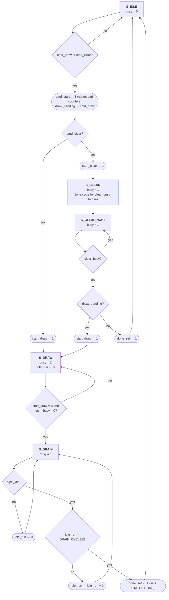

Commands that arrive while `busy = 1` are ignored: only `S_IDLE` looks at them.

---

## 2. `axil_regs`: AXI4-Lite slave

### Write channel

The write channel's state is the three flags `aw_held`, `w_held` and
`s_axi_bvalid`. AW and W are captured independently, in any order or in
the same cycle, so the chart is one ASM block with parallel decisions,
evaluated every cycle.

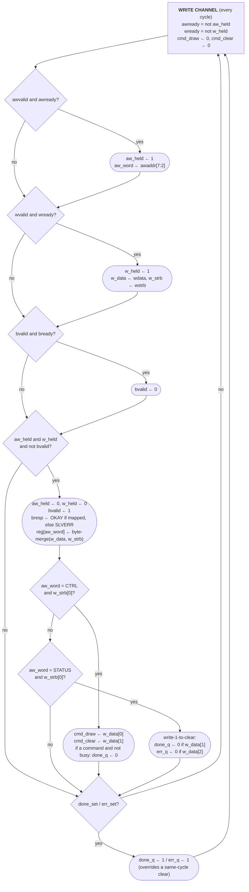

### Read channel

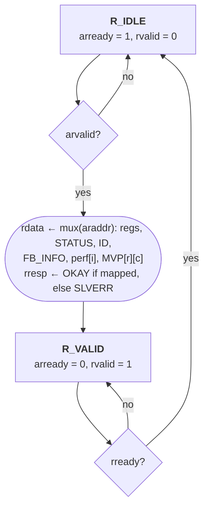

---

## 3. `vertex_fetch`: burst reader with prefetch

`IDLE` and `ACTIVE` are the `active` flag. In `ACTIVE`, four activities run
in the **same** clock cycle: issue a read request, receive a beat, output a
vertex, and check for completion. They are drawn as one ASM block.

```mermaid
flowchart TD
    I0["<b>IDLE</b><br/>busy = 0, rready = 1"] --> ST{"start?"}
    ST -- no --> I0
    ST -- yes --> CNT{"vertex_count = 0?"}
    CNT -- yes --> I0
    CNT -- no --> INIT(["active ← 1, err ← 0<br/>req_addr ← base with bits 3:0 cleared<br/>req_left ← vertex_count<br/>word_idx ← 0, beat_idx ← 0"])
    INIT --> ACT

    ACT["<b>ACTIVE</b><br/>busy = 1, rready = 1<br/>n = min(4, req_left, vertices to next 4 KB)"] --> ARH{"arvalid and arready?"}
    ARH -- yes --> ARH1(["arvalid ← 0"])
    ARH -- no --> ISS
    ARH1 --> ISS{"can_issue?<br/>not err, req_left ≠ 0,<br/>FIFO count + in flight + n ≤ 16,<br/>bursts_out below 4, AR slot free"}
    ISS -- yes --> ISS1(["arvalid ← 1, araddr ← req_addr<br/>arlen ← 4n − 1, len_q.push(n)<br/>req_addr ← req_addr + 16n<br/>req_left ← req_left − n<br/>inflight += n, bursts_out += 1"])
    ISS -- no --> RV
    ISS1 --> RV{"rvalid?"}
    RV -- no --> OUT
    RV -- yes --> BAD{"rresp ≠ OKAY or<br/>rlast ≠ (last beat of burst)?"}
    BAD -- yes --> BAD1(["err ← 1<br/>error_set ← 1 (first error only)"])
    BAD -- no --> WD
    BAD1 --> WD{"word_idx = 3?"}
    WD -- yes --> PUSH(["FIFO.push(x, y, z, rdata)<br/>unless err or this beat is bad<br/>inflight −= 1"])
    WD -- no --> WS(["word[word_idx] ← rdata"])
    PUSH --> LB
    WS --> LB{"last beat of burst?"}
    LB -- yes --> LB1(["len_q.pop, bursts_out −= 1<br/>beat_idx ← 0"])
    LB -- no --> LB2(["beat_idx += 1"])
    LB1 --> OUT
    LB2 --> OUT{"FIFO not empty and<br/>output free and not err?"}
    OUT -- yes --> OUT1(["out_x, out_y, out_z, out_color ← FIFO.pop<br/>out_valid ← 1"])
    OUT -- no --> ER
    OUT1 --> ER{"err?"}
    ER -- yes --> ER1(["flush FIFO, out_valid ← 0"])
    ER -- no --> DN
    ER1 --> DN{"bursts_out = 0, no AR pending, and<br/>(err or (req_left = 0 and FIFO empty<br/>and not out_valid))?"}
    DN -- yes --> DN1(["active ← 0"])
    DN1 --> I0
    DN -- no --> ACT
```

---

## 4. `geom_engine`: rate-matched transform

### Issue controller

Each vertex needs four row issues. `busy` and `row` are the state. All
transfers happen only when `en = 1`; with `en = 0` the whole unit holds.

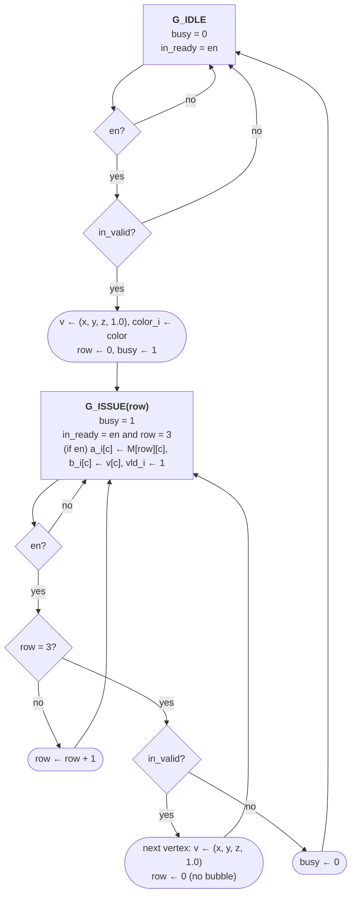

### Datapath pipeline (register transfers per stage, all gated by `en`)

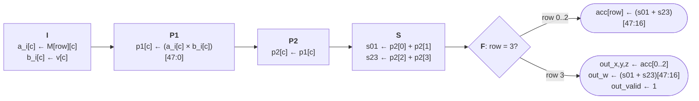

---

## 5. `persp_viewport` and `recip_pipe`: pure pipeline

There is no FSM: every stage moves one step whenever `en = 1`. Each box is
one pipeline register stage and its register transfers.

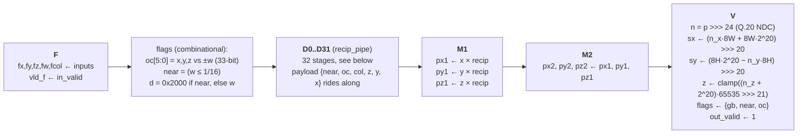

One stage `k` of `recip_pipe` (q = ⌊2⁴⁴ / d⌋, one quotient bit per stage,
initial `rem = 2^12`):

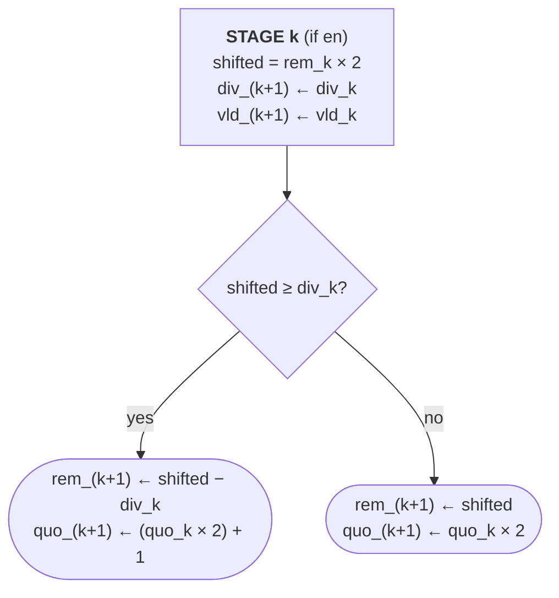

---

## 6. `prim_assembly`: triangle assembly

`count` is the state (vertices held). `flush`, pulsed at the start of every
draw, takes priority and discards a partial triangle. Separately, in every
state, `out_valid ← 0` when `out_valid and out_ready`.

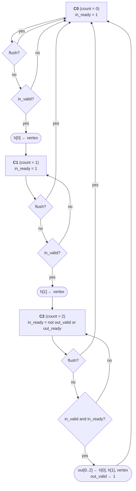

---

## 7. `tri_setup`: triangle setup

The main ASM. Two helper machines run concurrently inside `S_RUN`: the
iterative divider and the shared-multiplier pipeline. Each has its own chart
below.

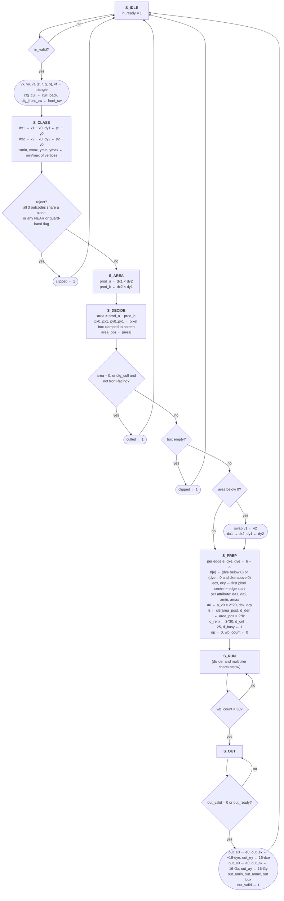

### Iterative reciprocal: R = ⌊2⁵⁵ / (area × 2^lz)⌋

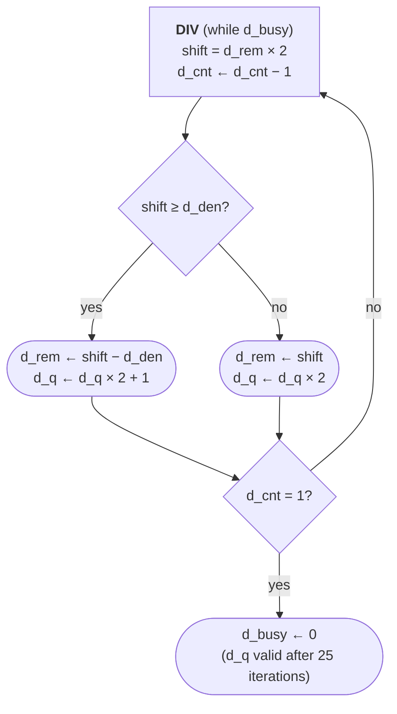

### Shared multiplier: issue and write-back

38 operations are issued in order, one per cycle when their inputs are
ready. Results return 4 cycles later: operand register, product, product
register, shift, then write-back.

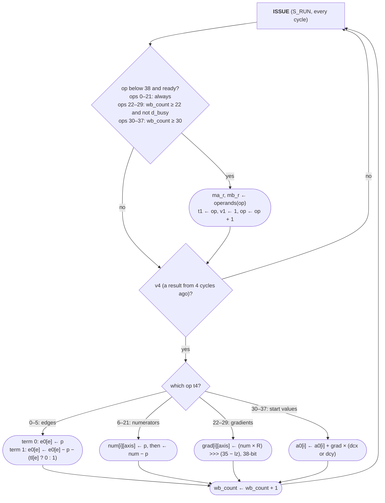

---

## 8. `rasterizer`: span rasterizer

Two cooperating ASMs plus an output register. **T** (traversal) walks the
bounding box `SPAN` pixels at a time. **S** (serializer) emits the covered
pixels of one span, one per cycle. T keeps skipping empty spans while S is
busy. A covered span has to wait until S can take it (`s_free`).

Shared signals:
- `mask[k] = (t_x + k ≤ px1) and all three e_cur[e] + exk[e][k] ≥ 0`
- `o_free = not frag_valid or frag_ready`
- `s_emit = s_valid and o_free`
- `s_free = not s_valid or (s_emit and only one mask bit left)`

### T: traversal

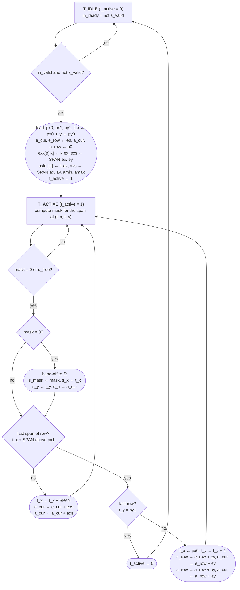

### S: serializer and output register

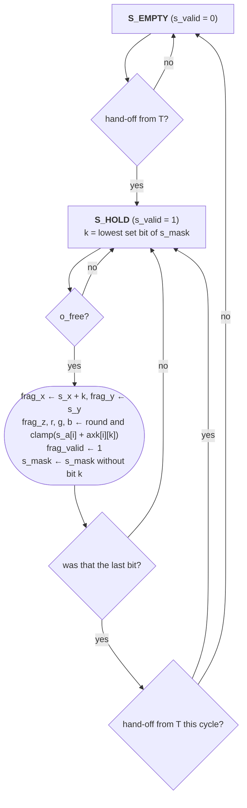

The output register clears (`frag_valid ← 0`) whenever `frag_ready = 1` and S
does not emit in that cycle.

---

## 9. `rop`: depth test, buffers and clear

### Clear engine

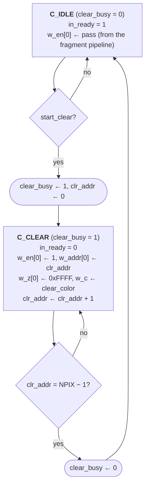

### Fragment pipeline, with the R3 forwarding decision

Every cycle, the write history shifts:
`w_*[2] ← w_*[1]`, `w_*[1] ← w_*[0]`. Entry 0 drives both RAMs' write ports.

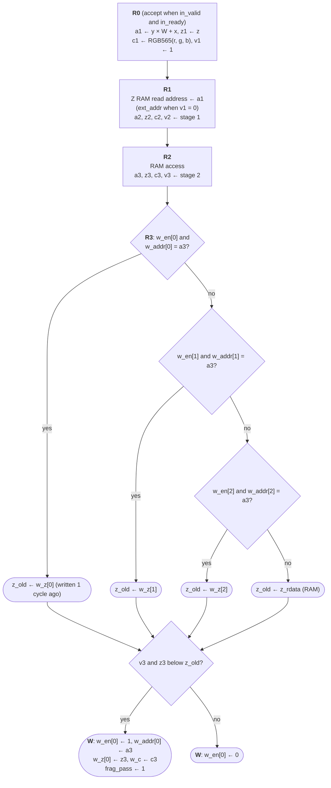

The newest matching write wins, so the chart checks entries 0, 1, 2 in that
order. `idle = not (v1 or v2 or v3 or w_en[0] or clear_busy)`, so
`gpu_ctrl` only reports DONE after the final RAM write has committed.
